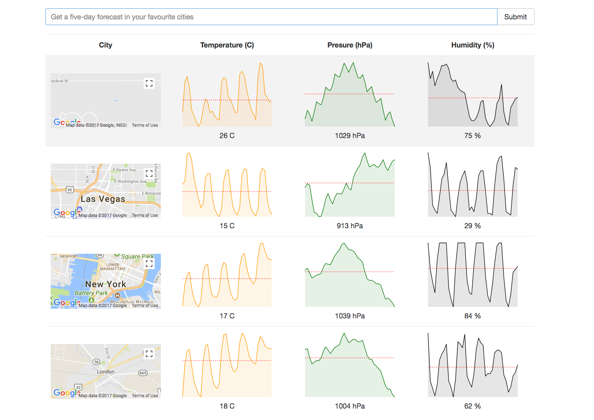

## Weather App

### Getting Started

There are two methods for getting started with this repo.

#### Familiar with Git?
Checkout this repo, install dependencies, then start the gulp process with the following:

```
> git clone https://github.com/danielemanuel/weather_app
> cd WeatherApp
> npm install
> npm start
```

#### Not Familiar with Git?
Click [here](https://github.com/danielemanuel/weather_app) then download the .zip file.  Extract the contents of the zip file, then open your terminal, change to the project directory, and:

```
> npm install
> npm start
```

### App description:

- The app is build using React with Redux
- The data is fetched from the weather API (http://openweathermap.org)
- For a better visualisation of the data I used React Sparklines for building the charts (https://github.com/borisyankov/react-sparklines)   
- Google Maps integration

  
